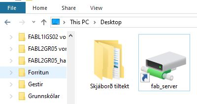
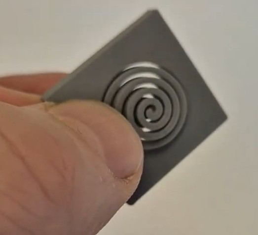
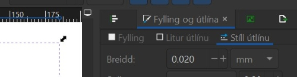
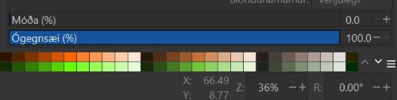

# 10. bekkur

## Að nota Inkscape forritið

!!!Info "Inkscape forritið"

    Við ætlum að nota forrit sem heitir Inkscape. Með því getum við hannað ótrúlega margt, til dæmis límmiða sem hægt er að skera út úr vínyl í vínylskera. Við getum líka hannað eitthvað til að skera og rastera í laser.

!!!Info "Að opna Inkscape"

    Ef þið sjáið ekki táknið getið þið skrifað Inkscape í leitargluggann neðst á skjánum.

    

!!!Info "Tvísmellið á táknið"

    Tvísmellið svo á táknið þegar þið sjáið það. Stundum er forritið lengi að opnast svo það er gott að bíða smástund til að sjá hvort það opnist. Annars tvísmellið þið aftur.

    

### Að skipta um tungumál í Inkscape

!!! Tip "Íslenska eða annað tungumál"

    Það er hægt að skipta um tungumál í Inkscape en **það þarf að loka forritinu þegar búið er að skipta um tungumál og opna forritið svo aftur**. Smellið á Breyta og svo Kjörstillingar. Hér fyrir neðan sjáið þið hvernig þetta lítur út þegar forritið er stillt á íslensku og þegar það er stillt á ensku.

               

!!!Tip "Íslenska eða annað tungumál - framhald"

    Því næst smellið þið á Viðmót (á ensku er það Interface) og þá sjáið þið hvar þið getið valið tungumál. Munið svo að loka forritinu og opna það aftur.

                

## Að vista verkefnin á réttum stað

### Að búa til möppu

!!!Example "Búðu til möppu fyrir þig ef þú átt ekki möppu"

    - Smelltu á **gula möpputáknið** neðst á skjánum. 

    - Smelltu svo á  **Desktop**. 

    - Næst smellir þú á **Fab Server** táknið sem er eins og gula mappan nema með grænum lit líka.  

    - Smelltu á **Grunnskólar 2025**.

    - Smelltu á **Verkvit**.
    
    - Hægrismelltu á skjáinn og veldu **Nýtt (New)** og svo **Mappa (Folder)**
    
    - Merktu möppuna með þínu nafni.

    - Ath! Best er að vista oft á meðan þú vinnur verkefnið, svo upplýsingar glatist ekki.

    

### Að velja rétta möppu þegar vistað er í Inkscape

!!!Example "Vistaðu Inkscape verkefnin þín í réttri möppu"

    Þegar þú vistar verkefnin skaltu passa að þau séu að vistast í þinni möppu en ekki möppu sem einhver annar á. Þú gerir þetta svona:

    - Farðu í **Skrá (File)** og veldu **Vista sem (Save As)**. 
    
    - Veldu möppuna sem þú vilt vista verkefnið í. 

    - Smelltu á **Vista (Save)**.

    - Ath! Best er að vista oft á meðan þú vinnur verkefnið, svo upplýsingar glatist ekki.

## Verkefni 1 - Límmiði

!!!success "Mikilvæg upprifjun"

    Það er líklegt að þú hafir búið til límmiða áður en þetta er mikilvæg upprifjun og því vinna allir þetta verkefni. Hafðu í huga að það er hægt að búa til allt mögulegt. Þú getur til dæmis búið til límmiða á tölvuna þína, límmiða á veggi, fatalímmiða og endurskinsmerki.

    Þú getur skoðað hugmyndir á Pinterest [hér](https://www.pinterest.com/hannesdttir/l%C3%ADmmi%C3%B0ar/).

!!!question "Hvaða aðferð finnst þér best?"

    Hvort finnst þér betra að lesa leiðbeiningar eða horfa á kennslumyndband? Veldu annaðhvort **Skriflegar leiðbeiningar** eða **Kennslumyndband** hér fyrir neðan.

### Skriflegar leiðbeiningar - Límmiði

!!! info "Skriflegar leiðbeiningar um gerð límmiða"

    Farið eftir leiðbeiningunum [hér](https://www.fabmennt.com/_files/ugd/0ebced_5a3d811e82fa4290be7d3fb604a5251b.pdf). Lesið samt fyrst upplýsingarnar hér fyrir neðan. *Leiðbeiningarnar gerði Hafey Viktoría Hallgrímsdóttir hjá Fab Lab Reykjavík.*

!!!Tip "Tvö mikilvæg atriði"

    Munið að vista verkefnið reglulega með því að ýta á **Skrá og Vista**  eða **File og Save**. Þið getið líka vistað með því að **halda inni CTRL takkanum og ýta á bókstafinn S**

    **Athugið að vista verkefnið í lokin bæði sem Inskcape skjal (með endingunni .svg) og PDF skjal (með endingunni .pdf).** 

!!!Tip "Eitt mikilvæg atriði til viðbótar"

    Þegar hönnunin er tilbúin er blaðsíðan oft stærri en það sem þið ætlið að búa til. Þá er gott að minnka blaðsíðuna til að efnið nýtist betur. Það gerið þið svona:

    Smellið á **Skrá (File) og Skráareiginleikar (Document Properties)**. Það er líka hægt að hægrismella á skjáinn og velja **Eiginleikar skjals (Document properties)**. Smellið svo á litla hnappinn hægra megin við **Aðlaga stærð að innihaldi (Resize to content).** Þá minnkar hvíta svæðið þannig að það passar nákvæmlega utan um hönnunina. Svo þarf að stækka það aðeins með því að smella þrisvar sinnum á báða plúsana.

           

!!!Tip "Mismundandi útlit í tölvum"

    Stundum lítur þetta öðruvísi út í tölvum (sjá hér fyrir neðan). Þá þarf að skrifa 1 í alla fjóra gluggana og smella svo á ,,Laga síðu að teikningu eða vali“ (Resize page to content).

    

### Kennslumyndband - límmiði

!!!Tip "Myndband"

    Myndbandið hér [hér](https://www.fabmennt.com/myndbondvinyl?wix-vod-video-id=db87a908a65e4c71819b4b41228c9e97&wix-vod-comp-id=comp-l028k5p5) sýnir hvernig límmiði er búinn til. *Leiðbeiningarnar gerði Andri Sæmundsson hjá Fab Lab Reykjavík*

    

    Munið að vista verkefnið reglulega með því að ýta á **Skrá og Vista**  eða **File og Save**. Þið getið líka vistað með því að **halda inni CTRL takkanum og ýta á bókstafinn S.**

    **Athugið að vista verkefnið í lokin bæði sem Inskcape skjal (með endingunni .svg) og PDF skjal (með endingunni .pdf).** 

## Verkefni 2 - Tinkercad

!!! Info "Að fara inn á Tinkercad"

    Smellið á hlekkinn [hér](https://www.tinkercad.com/joinclass/DA2REYMTH). Smellið á græna hnappinn (join with login code) og skrifið notendanafnið ykkar. Notendanafnið er nafnið ykkar og eftirnafnið - allt með lágstöfum (litlum stöfum) og ekkert bil á milli nafnanna. Ef þið heitið tveimur nöfnum eða fleirum eigið þið bara að nota fyrsta nafnið og svo eftirnafnið.

    Veljið svo eitt af verkefnunum hér fyrir neðan:

### Kennslumyndband - Tinkercad fiktdót/hnappur

!!! Info "Kennslumyndband sem kennir hvernig hægt er að búa til hnapp-fiktdót"

    Smellið á hlekkinn [hér](https://www.youtube.com/watch?v=5SBwd5mZFA8). 

    

### Kennslumyndband - Tinkercad fiktdót/stjarna

!!! Info "Kennslumyndband sem kennir hvernig hægt er að búa til stjörnu-fiktdót"

    Smellið á hlekkinn [hér](https://www.youtube.com/watch?v=syrVd6qa8q4). 

## Verkefni 3 - rennismellur

### Skriflegar leiðbeiningar - rennismellur

!!!Tip "Leiðbeiningar - rennismellur"

    Athugið að í leiðbeiningunum er jólatré búið til. Þið getið búið til allt mögulegt. Gætið þess bara að raufarnar, sem eiga að passa saman, séu jafnlangar.
    Farið eftir leiðbeiningunum [hér](https://www.fabmennt.com/_files/ugd/0ebced_d9c3f8b01f3343d1b9cdb20555951928.pdf). *Leiðbeiningarnar gerði Hafey Viktoría Hallgrímsdóttir hjá Fab Lab Reykjavík.*

    

### Myndband - rennismellur

!!!Tip "Myndband"

    Myndbandið [hér](https://www.fabmennt.com/myndbondgeisla?wix-vod-video-id=2cc7ba8af64649318bb3ec98d6022eaf&wix-vod-comp-id=comp-l0gj7s07) sýnir hvernig rennismellur eru búnar til. *Leiðbeiningarnar gerði Andri Sæmundsson hjá Fab Lab Reykjavík*

### Verkefni 4 - verkefni að eigin vali

!!! Info "Hvað langar þig að gera?"

    Nú mátt þú vinna verkefni að eigin vali.

## Kom upp vandamál?

### Hönnunin hverfur þegar ég stilli línuþykktina á 0,02mm

!!! bug "Fyrsta athugun"

    Haltu niðri **CTRL** takkanum og snúðu músarhjólinu. Með því ertu að þysja inn þar sem músin þín er staðsett (örin á skjánum). Passaðu því að hafa músina þína á hönnuninni þinni. Sérðu línurnar þegar þú þysjar inn? Það er vegna þess að þær eru svo örmjóar að þær sjást varla þegar þær eru stilltar á 0,02mm. Ef þú sérð línurnar núna er allt í góðu og þú getur haldið áfram með það sem þú þarft að gera. 

!!! bug "Athugaðu þetta ef þú sást ekkert við fyrstu athugun"

    Athugaðu hvort það stendur 0,020 eða 0.000 í reitnum þar sem þú breyttir línunni. Ef það stendur 0.000 skaltu prófa að nota punkt en ekki kommu þegar þú skrifar aftur 0.020. Í sumum tölvum þarf að nota punkt. Vonandi birtist hönnunin þín við þetta.

    Kannski gleymdir þú bara að stilla **stíl útlínu (stroke style)** á 0,02. Kannski minnkaðir eða stækkaðir þú hönnunina eftir að búið var að stilla línuþykktina. Þá breytist þykktin á línunni. Mundu því að stilla alltaf línuþykktina upp á nýtt ef þú breytir stærðinni á einhverju í hönnuninni.
    
    

### Ekkert gerist þegar form er teiknað í Inkscape

!!! bug "Fyrsta athugun"

    Staðsettu músina þína aðeins fyrir ofan og til vinstri við svæðið sem þú varst að teikna á. Haltu músarhnappnum niðri og dragðu músina á ská niður yfir allt svæðið sem þú teiknaðir á. Þannig ertu að veiða formið/velja það. Smelltu svo á **Hlutur** og svo **Fylling og útlína**. Kveiktu á fyllingunni svona:

    Birtist formið núna? Það er vegna þess að það var slökkt á fyllingunni og línunni en núna er kveikt á fyllingunni.

    

!!! bug "Athugaðu þetta ef þú sást ekkert við fyrstu athugun"

    Athugaðu hvort það er búið að stilla **ógegnsæi(opacity)** á 0. Þá þarf að draga stikuna upp í 100%. Þú finnur þessa stiku neðst til hægri í Inkscape.

    Birtist formið núna? Það er vegna þess að liturinn var gegnsær en núna er hluturinn ekki gegnsær lengur. 

    

!!! bug "Þriðja athugun"

    Athugaðu hvort það er búið að stilla **Alpha (Alpha channel)** á 0. Þá þarf að draga stikuna upp í 100%. Þú finnur þessa stiku neðst undir stillingunum fyrir liti bæði undir flipanum fyrir **fyllingu** og **lit útlínu** í Inkscape. Hún er merkt með bókstafnum **A**.

    

### Vélin sker ekki skurðarlínurnar

!!! bug "Fyrsta athugun"

    Opnaðu hönnunina þína í Inkscape. Veldu hönnunina. Smelltu á **Hlutur** og svo **Fylling og útlína**. Smelltu á flipann sem er merktur sem **Stíll útlínu (stroke style)**. Athugaðu hvort línuþykktin er stillt á 0.02mm. Ef talan er önnur þarftu að breyta henni í 0.02. Svo þarftu að vista þetta aftur sem PDF skjal. Ef þú færð meldingu um að það sé ekki hægt, getur verið að gamla PDF skjalið sé enn opið. Þú þarft að loka því svo það sé hægt að vista breytingarnar.

    

!!! bug "Athugaðu þetta ef þú sást ekkert við fyrstu athugun"

    Athugaðu hvort það er búið að stilla **ógegnsæi(opacity)** á 0. Þá þarf að draga stikuna upp í 100%. Þú finnur þessa stiku neðst til hægri í Inkscape.

    Vélin vill alls ekki nota línur með gegnsæi, jafnvel þó **ógegnsæi (opacity)** sé bara pínulítið og næstum því 100%, til dæmis stillt á 99%, er það nóg til að vélin geti ekki skorið línuna. Passaðu því að skurðarlínur séu alltaf stilltar á 100%.

    

