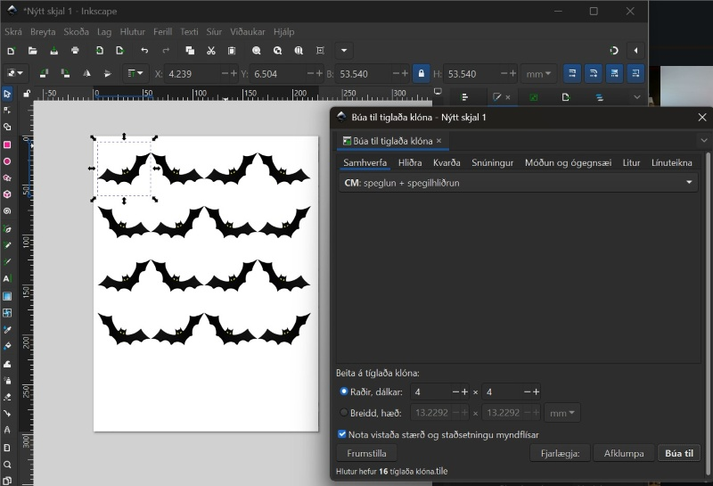
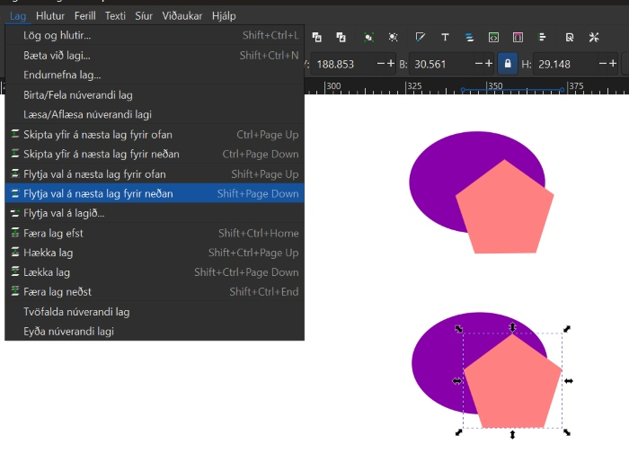
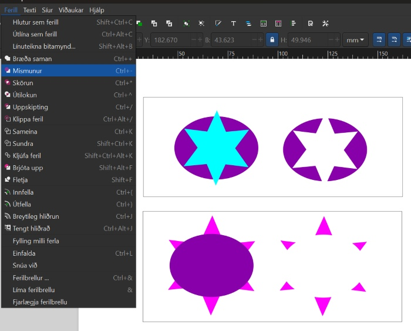
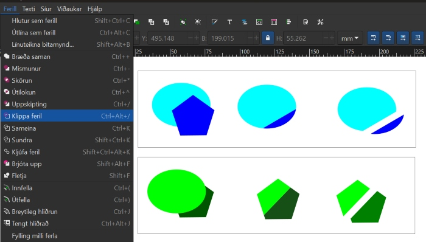

# Áfangar hjá Verkmenntaskóla Austurlands

## FABL2GR05

### Að búa til mynstur (límmiðar/fatalímmiðar og fleira)

!!!Info "Að finna mynd á netinu"

    * Bættu orðinu **Silhouette** eða **Black and white** fyrir aftan leitarorðið þitt til að fá skýra, svart/hvíta mynd. 
    * Smelltu á **Mynd (Image)**. 
    * Smelltu svo á **Verkfæri (Tools)** 
    * Veldu Creative Commons leyfið.

    

    * Vistaðu myndina.

!!!Info "Að flytja myndina inn í Inkscape"

    * Opnaðu Inkscape forritið
    * Veldu **Skrá (File)** og **Flytja inn (Import)**. 
    * Veldu myndina og smelltu á **Opna (Open)**.
    * Smelltu á **Í lagi (OK)**.

!!!Info "Að búa til vektormynd"

    * Veldu **Ferill (Path)** og **Línuteikna bitamynd (Trace bitmap)**. 
    * Þegar smellt er á **Uppfæra (Update)** er sýnt hvernig myndin muni líta út. Reyndar gefur það ekki alltaf nákvæma mynd en oftast virkar það sem **Preview**. 
    * Smellið svo á **Í lagi (Apply)**. Í sumum tölvum stendur **Virkja** en ekki **Í lagi**. 
    * Vinstri-smelltu með músinni ofan á myndina, haltu takkanum inni og dragðu myndina til hliðar. 
    * Smellið til skiptis á báðar myndirnar. Þegar það stendur ,,Mynd“ (Image)  neðst á skjánum má eyða þeirri mynd. 

!!!Info "Að búa til mynstur í Inkscape"

    * Veldu myndina.
    * Smelltu á **Breyta (Edit)**, svo **Klóna (Clone)** og að lokum á **Búa til tíglaða klóna (Create tiled clones)**.

    

    * Á myndinn hér fyrir neðan sést hvernig búið er að nota litlu örina hægra megin til að velja **CM: speglun + spegilhliðrun**. Það sést einnig neðarlega að búið er að skrifa 4 raðir og 4 dálka. Útkoman sést á myndinni.  

    

    * Taktu eftir því að það eru örvar í kringum upphaflegu vektormyndina. Hún liggur í raun ofan á mynstrinu sem þú varst að búa til. Dragðu hana til hliðar. Þú getur notað þessa vektormynd til að prófa þig áfram með önnur mynstur. Prófaðu að nota örina og velja aðrar útfærslur

    

    * Veldu mynstrið sem þú vilt eiga. **Hægrismelltu á skjáinn** og veldu **Eiginleikar skjals (Document properties)**. 
    * Smelltu á **Aðlaga stærð að innihaldi (Resize to content)**.
    * Smelltu þrisvar á báða plúsana.
    * Færðu mynstrið inn á miðja blaðsíðuna.
    * Vistaðu skjalið sem **.svg og sem .pdf.**

### Að búa til límmiða í mörgum litum

!!!Example "Að finna mynd á netinu sem hægt er að hafa í nokkrum litum"

    * Bættu orðinu **Silhouette** eða **Black and white** fyrir aftan leitarorðið þitt til að fá skýra, svart/hvíta mynd. Leitaðu eftir mynd sem hægt er að gera í a.m.k. þremur litum.
    * Smelltu á **Mynd (Image)**. 
    * Smelltu svo á **Verkfæri (Tools)** 
    * Veldu **Creative Commons leyfið**.

    

    * Vistaðu myndina.

    * Ath! Þú getur líka leitað að mynd í lit en hún verður þá að vera mjög skýr með miklum andstæðum (contrast) á milli litaðra svæða. Þessi mynd hér fyrir neðan var tekin af slóðinni [hér](https://vectorportal.com/vector/skull-sticker/35973)

    Við viljum virða höfundarrétt og á þessari síðu er óskað eftir því að vísað sé í höfundinn og leyfið sem veitt er á þennan hátt:

    Image by <a href=" https://www.vectorportal.com" >Vectorportal.com</a>,  <a class="external text" href="https://creativecommons.org/licenses/by/4.0/" >CC BY</a>

    

!!!Example "Að flytja myndina inn í Inkscape"

    * Opnaðu Inkscape forritið
    * Veldu **Skrá (File)** og **Flytja inn (Import)**. 
    * Veldu myndina og smelltu á **Opna (Open)**.
    * Smelltu á **Í lagi (OK)**.

!!!Example "Að búa til vektormynd"

    * Veldu **Ferill (Path)** og **Línuteikna bitamynd (Trace bitmap)**. 
    * Þegar smellt er á **Uppfæra (Update)** er sýnt hvernig myndin muni líta út. Reyndar gefur það ekki alltaf nákvæma mynd en oftast virkar það sem **Preview**. 
    * Smellið svo á **Í lagi (Apply)**. Í sumum tölvum stendur **Virkja** en ekki **Í lagi**. 
    * Vinstri-smelltu með músinni ofan á myndina, haltu takkanum inni og dragðu myndina til hliðar. 
    * Smellið til skiptis á báðar myndirnar. Þegar það stendur ,,Mynd“ (Image)  neðst á skjánum má eyða þeirri mynd. 

    

!!!Example "Að sundra öllu"

    * Veldu myndina. 
    * Smelltu á **Ferill (Path)** og veldu **Sundra (Break apart)**. Þá verður myndin oft alveg svört en þá er til dæmis hægt að slökkva á fyllingunni og kveikja á línunni, sjá hér á eftir.
    * Smelltu á **Hlutur (Object)** og veldu **Fylling og útlína (Fill and stroke)**.
    * Smelltu á **Litur útlínu (Stroke paint)** og veldu **Flatur litur (Flat color – sem er skammstafað RGB)** og stilltu **rauðan í fullt (255)**. 
    * Smelltu á **Stíll útlínu (Stroke style)** og stilltu línurnar á **0.100mm**. Þá sjást allar línur vel á meðan unnið er með myndina. **Passaðu svo að muna eftir því að stilla línurnar seinna þannig að þær verði skurðarlínur. Það verður útskýrt betur seinna í verklýsingunni**.

    

!!!Example "Að búa til ferhyrning til viðmiðunar fyrir samsetningu"

    * Smelltu á kassatáknið og teiknaðu lítinn ferhyrning við hliðina á myndinni. (Sjá myndina hér fyrir ofan og svo nærmyndina af ferhyrningunum hér fyrir neðan).
    * Teiknaðu svo annan minni ferhyrning innan í. Stærri ferhyrningurinn verður að útlínum fyrir minni ferhyrninginn. Það koma betri útskýringar um notkun kassanna á eftir.

    

!!!Example "Að búa til sér skjal fyrir hvern lit"

    * Þessi límmiði á að vera í þremur litum og þess vegna þarf að búa til þrjú Inkscape skjöl. 
    * Hér fyrir neðan sést hvaða línur skera hvern lit. Undir línunum eru myndir af límmiðunum sem verða skornir út. Vinstra megin eru línurnar sem eiga að skera gulan, í miðjunni er línan sem á að skera svartan og til hægri eru línurnar sem eiga að skera hvítan. Gula hlutann þarf að skera tvisvar vegna þess að litlu bútarnir eiga að vera efst. **Mikilvægt!: Þessi mynd er einungis sett svona upp til að útskýra. Það má alls ekki færa línurnar í sundur, heldur þarf að vista eitt skjal fyrir hvern lit. Svo má eyða línum en alls ekki færa línurnar!**

    

    * Vistaðu eitt skjal fyrir hvern lit:
    * Farðu fyrst í **Skrá (File)** og veldu **Vista sem (Save as)** til að vista fyrsta skjalið í Inkscape. Gefðu skjalinu nafn, til dæmis **Hauskúpa_svört**.
    * Smelltu svo á **Skrá (File)** og veldu **Vista sem (Save as)** til að vista annað skjalið í Inkscape. Gefðu skjalinu nafn, til dæmis **Hauskúpa_hvít**.
    * Farðu svo aftur í **Skrá (File)** og veldu **Vista sem (Save as)** til að vista þriðja skjalið í Inkscape. Gefðu skjalinu nafn, til dæmis **Hauskúpa_gul**.
 
!!!Example "Skjal fyrir stærsta límmiðann/grunninn"

    * Skoðaðu myndina vel og veldu hvaða svæði hentar sem stærsti límmiðinn sem hinir límmiðarnir (hinir litirnir) verða límdir ofaná. Hér var ákveðið að það væri hentugt að velja ystu línuna og nota gulan sem grunn. 
    * Skjalið sem heitir **Hauskúpa_Gul** var opnað.
    * Þar var öllum línum úr hauskúpunni eytt nema ystu línunni. Hinir litirnir voru svo límdir ofan á þetta form þegar búið var að skera út límmiðana.
    * ATH! Þegar farið var að plokka burtu það sem á ekki að vera hjá þessum límmiða var passað að plokka litla ferhyrninginn innan úr stóra ferhyrningnum. **Semsagt: Í skjalinu fyrir stærsta límmiðann á að plokka litla ferhyrninginn innan úr stóra ferhyrningnum. Hér er það þá ljósblái ferhyrningurinn sem á að plokka burt af límmiðanum.**

    
    
    * Svo var smellt á **Skrá (File)** og **Skráareiginleikar (Document Properties)**. Svo var smellt á **Aðlaga stærð að innihaldi (Resize to content)** til að nýta efnið vel.
    * Svo voru skurðarlínur eins og lýst er hér neðar.

!!!Example "Að stilla skurðarlínur"

    Smelltu svo á **Hlutur (Object)** og veldu **Fylling og útlína (Fill and stroke)**. Veldu fyrst flipann sem er merktur **Fylling (Fill)**. Þar á að slökkva á fyllingunni með því að velja **X**.

    

    Veldu næst flipann sem er merktur **Litur útlínu (Stroke paint)** og kveiktu með því að **velja reitinn við hliðina á x-inu**. Stilltu svo rauða litinn á **255**.

    

    Veldu flipann sem er merktur **Stíll útlínu (Stroke style)** og stilltu breidd línunnar (width) á 0.02 mm.

    

!!!Example "Að stilla síðuna og vista skjalið"

    * **Hægrismelltu á skjáinn** og veldu **Eiginleikar skjals (Document properties)**. 
    * Veldu myndina.
    * Smelltu á **Aðlaga stærð að innihaldi (Resize to content)**.
    * Smelltu þrisvar á báða plúsana.
    * Færðu myndina inn á miðja blaðsíðuna.
    * Vistaðu skjalið sem **.svg og sem .pdf.**

!!!Example "Skjölin fyrir hina litina"

    * Opnaðu hin skjölin með skurðarlínunum fyrir hina litina. 
    * Eyddu öllum línum sem eiga ekki að vera.
    * Aðlagaðu stærð skjalsins að innihaldi, eins og gert var í fyrsta skjalinu.
    * Stilltu skurðarlínur, eins og gert var í fyrsta skjalinu.
    * Vistaðu skjalið sem **.svg** og sem **.pdf**, eins og í fyrsta skjalinu.
    * Þegar búið er að skera út límmiðana í þessum litum er stærri ferhyrningurinn plokkaður í burtu (dökkblái ferhyrningurinn sem sést hér fyrir neðan):

    

!!!Example "Límmiðabútum raðað saman"

    * Þegar búið er að skera út límmiðana í öllum litum er flutningsfilma notuð til að flytja límmiðabútana ofan á stóra límmiðann. 
    * Látið litla ferhyrninginn passa innan í stóra ferhyrninginn. Þannig lendir allt á réttum stað.

    

### Að búa til logo

!!!tip "Logo"

    Logo getur verið búið til úr texta og/eða mynd. Hér á eftir koma dæmi um hvernig hægt er að vinna með texta og form. Þegar þú hannar logo skaltu hafa í huga hvað þú vilt að fólk sjái fyrir sér þegar það sér logoið. Reyndu að hafa það skýrt og einfalt. Hugsaðu líka um hvaða litir falli best að hugmynd þinni og hvaða litir séu grípandi/áberandi. 

!!!tip "Texta breytt í feril"

    Smelltu á **A** (táknið fyrir texta) sem er á stikunni vinstra megin. Skrifaðu textann sem þú vilt hafa í logoinu. Veldu svo **Ferill (Path)** og því næst **Hlutur sem ferill (Object to path)**. 

    

!!!tip "Að nota Hnútaverkfæri (Node tool) til að breyta texta"

    Smelltu á táknið fyrir **Hnútaverkfæri (Node tool)**. Þá sérðu punkta sem hægt er að vinna með. Þessa punkta er hægt að draga til og frá. Á stikunni fyrir ofan sérðu meðal annars hvernig hægt er að bæta við punktum með plústákninu, fækka punktum með mínus, slíta tengsl á milli punkta og fleira. 

    

!!!tip "Að nota handföngin á punktunum til að beygja form"

    Smelltu á táknið sem örin bendir á. Hnappurinn heitir **Sýna Bezier-haldföng fyrir valda hnúta (Show Bezier handles for selected nodes)**. Þá sjást handföngin á punktunum og með því að færa handföngin til er hægt að breyta löguninni á forminu/bókstafnum.

    

!!!tip "Myndbönd sem sýna hvernig hægt er að vinna með letur"

    Hér fyrir neðan má finna myndbönd sem sýna hvernig hægt er að breyta letri í Inkscape á ýmsan hátt. Athugaðu að sum myndböndin spilast mjög hratt:

    [Hér](https://www.youtube.com/watch?v=BI8Nw69Vn5o) er myndband sem sýnir hvernig einn bókstafur í orði er stækkaður og hann látinn klippa af bókstöfunum við hliðina á honum.

    [Hér](https://www.youtube.com/shorts/em8nQeE5DJw) er myndband sem sýnir dæmi um hvernig hægt er að teygja til bókstafi.

    [Hér](https://www.youtube.com/shorts/xqJQoxrLJak) er myndband sem sýnir hvernig hægt er að láta texta fylgja formi til að ná fram fjarvídd.

    [Hér](https://www.youtube.com/shorts/uJny3tSsH-4) er myndband sem sýnir hvernig hægt er að fjölfalda form og snúa þeim til að búa til mynstur.

    [Hér](https://www.youtube.com/watch?v=BI8Nw69Vn5o) er myndband sem sýnir dæmi um hvernig hægt er að breyta letri í Inkscape.

### Að sameina eða sundra formum á mismunandi hátt

#### Að færa form á milli laga (layers)

!!!tip "Að færa form á milli laga (layers)"

    Athugaðu að stundum skiptir máli hvort form liggur ofaná eða undir öðru formi. Því þarftu að vita hvernig á að færa form upp eða niður á milli laga. Veldu formið sem þú vilt færa. Smelltu á **Lag (layer)** og svo **Lög og hlutir (Layers and objects)**. Þar undir er hægt að velja að færa form upp og niður á milli laga.

    

#### Að bræða saman

!!!tip "Að bræða saman (Union)"

    Smellt var á **Ferill (Path)** og svo á **Bræða saman (Union)**. Þessi aðgerð bræðir saman tvö form þannig að þau verða að einu formi.

    

#### Mismunur (Difference)

!!!tip "Mismunur (Difference)"

    Hér voru búin til fjögur form og þau höfð í mismunandi litum. Hér var bláa stjarnan höfð ofaná sporöskjunni en bleika stjarnan höfð undir sporöskjunni. Þegar smellt var á **Ferill (Path)** og svo á **Mismunur (Difference)**. Efra formið eyðir þeim svæðum þar sem formið liggur ofan á neðra forminu.

    

#### Skörun (Intersection)

!!!tip "Skörun (Intersection)"

    Smellt var á **Ferill (Path)** og svo á **Skörun (Intersection)**. Formin skerast á nákvæmlega sama hátt, svo það skiptir ekki máli hvort formið er ofaná og hvort er undir. Einungis svæðið, sem bæði formin snertast á, verður eftir. Hitt eyðist. Nýju formin taka á sig lit formsins sem var undir.

    

#### Útilokun (Exclusion)

!!!tip "Útilokun (Exclusion)"

    Smellt var á **Ferill (Path)** og svo á **Útilokun (Exclusion)**. Formin skerast á nákvæmlega sama hátt, svo það skiptir ekki máli hvort formið er ofaná og hvort er undir. Svæðið, sem bæði formin snertast á, eyðist út. Nýju formin taka á sig lit formsins sem var undir.

    

#### Uppskipting

!!!tip "Uppskipting (Division)"

    Smellt var á **Ferill (Path)** og svo á **Uppskipting (Division)**. Á efri myndinni sést hvernig bleika formið klippir einungis það svæði af neðra forminu þar sem það liggur ofaná. 

    Á neðri myndinni sést að fjólubláa sporaskjan liggur ofaná og hún klippir einungis af svæðinu sem hún snertir.

    

    [Hér](https://www.youtube.com/shorts/6jVaVTWy6V4) er svo myndband sem sýnir hvernig hægt er að nota uppskiptingu (division).

#### Að klippa feril (Cut path)

!!!tip "Klippa feril (Cut path)"

    Smellt var á **Ferill (Path)** og svo á **Klippa feril (Cut path)**. Þessi aðgerð skilur einungis eftir neðra formið og býr til skurðarlínur inni í því þar sem efra formið lá. Það er því hægt að færa svæðin innan formsins í sundur, eins og sést á myndinni hér fyrir neðan. 
    
    Athugaðu að aðgerðin slekkur á litnum, svo það lítur út fyrir að formunum hafi verið eytt, því þau sjást ekki. Þegar kveikt er á litnum aftur sjást formin.

    

