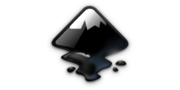
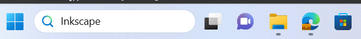
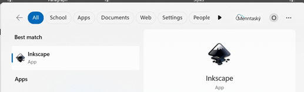
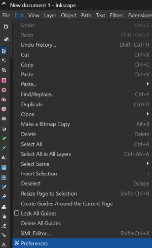
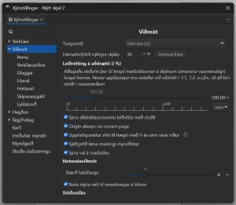
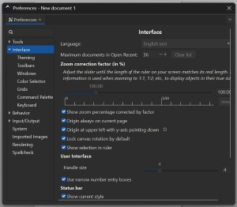

# Grunnskólar

## Að nota Inkscape forritið

!!!Info "Inkscape forritið"

    Við ætlum að nota forrit sem heitir Inkscape. Með því getum við hannað ótrúlega margt, til dæmis límmiða sem hægt er að skera út úr vínyl í vínylskera. Við getum líka hannað eitthvað til að skera og rastera í laser.

!!!Info "Að opna Inkscape"

    Tvísmellið á Inkscape táknið til að opna forritið. Ef þið sjáið ekki táknið getið þið skrifað Inkscape í leitargluggann neðst á skjánum og tvísmellt svo á táknið þegar það birtist.

!!!Info "Tvísmellið á táknið"

    Tvísmellið svo á táknið þegar þið sjáið það. Stundum er forritið lengi að opnast svo það er gott að bíða smástund til að sjá hvort það opnist. Annars tvísmellið þið aftur.

## Að skipta um tungumál í Inkscape

!!!Tip "Íslenska eða annað tungumál"

    Það er hægt að skipta um tungumál í Inkscape en það þarf að loka forritinu þegar búið er að skipta um tungumál og opna forritið svo aftur. Smellið á Breyta og svo Kjörstillingar. Hér fyrir neðan sjáið þið hvernig þetta lítur út þegar forritið er stillt á íslensku og þegar það er stillt á ensku.

           

!!!Tip "Íslenska eða annað tungumál - framhald"

    Því næst smellið þið á Viðmót (á ensku er það Interface) og þá sjáið þið hvar þið getið valið tungumál. Munið svo að loka forritinu og opna það aftur.

            

## 9. bekkur

## 10. bekkur