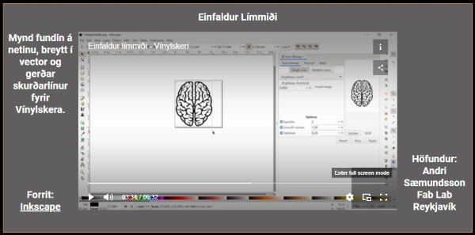

# Grunnskólar
## Að nota Inkscape forritið

!!!Info "Inkscape forritið"

    Við ætlum að nota forrit sem heitir Inkscape. Með því getum við hannað ótrúlega margt, til dæmis límmiða sem hægt er að skera út úr vínyl í vínylskera. Við getum líka hannað eitthvað til að skera og rastera í laser.

!!!Info "Að opna Inkscape"

    Tvísmellið á Inkscape táknið til að opna forritið. Ef þið sjáið ekki táknið getið þið skrifað Inkscape í leitargluggann neðst á skjánum og tvísmellt svo á táknið þegar það birtist.

    

!!!Info "Tvísmellið á táknið"

    Tvísmellið svo á táknið þegar þið sjáið það. Stundum er forritið lengi að opnast svo það er gott að bíða smástund til að sjá hvort það opnist. Annars tvísmellið þið aftur.

    

## Að skipta um tungumál í Inkscape

!!!Tip "Íslenska eða annað tungumál"

    Það er hægt að skipta um tungumál í Inkscape en það þarf að loka forritinu þegar búið er að skipta um tungumál og opna forritið svo aftur. Smellið á Breyta og svo Kjörstillingar. Hér fyrir neðan sjáið þið hvernig þetta lítur út þegar forritið er stillt á íslensku og þegar það er stillt á ensku.

               

!!!Tip "Íslenska eða annað tungumál - framhald"

    Því næst smellið þið á Viðmót (á ensku er það Interface) og þá sjáið þið hvar þið getið valið tungumál. Munið svo að loka forritinu og opna það aftur.

                

## 9. bekkur

### Verkefni 1 - Að búa til límmiða

!!!question "Hvaða aðferð finnst þér best?"

    Hvort finnst þér betra að lesa leiðbeiningar eða horfa á kennslumyndband? Veldu annaðhvort **Skriflegar leiðbeiningar** eða **Kennslumyndband** hér fyrir neðan.

#### Skriflegar leiðbeiningar - límmiði

Farið eftir leiðbeiningunum [hér](https://www.fabmennt.com/_files/ugd/0ebced_5a3d811e82fa4290be7d3fb604a5251b.pdf). Lesið samt fyrst upplýsingarnar hér fyrir neðan. *Leiðbeiningarnar gerði Hafey Viktoría Hallgrímsdóttir hjá Fab Lab Reykjavík.*

!!!Tip "Tvö mikilvæg atriði"

    Munið að vista verkefnið reglulega með því að ýta á **Skrá og Vista**  eða **File og Save**. Þið getið líka vistað með því að **halda inni CTRL takkanum og ýta á bókstafinn S**

    **Athugið að vista verkefnið í lokin bæði sem Inskcape skjal (með endingunni .svg) og PDF skjal (með endingunni .pdf).** 

!!!Tip "Eitt mikilvæg atriði til viðbótar"

    Þegar hönnunin er tilbúin er blaðsíðan oft stærri en það sem þið ætlið að búa til. Þá er gott að minnka blaðsíðuna til að efnið nýtist betur. Það gerið þið svona:

    Smellið á **Skrá (File) og Skráareiginleikar (Document Properties)**. Það er líka hægt að hægrismella á skjáinn og velja **Eiginleikar skjals (Document properties)**. Smellið svo á litla hnappinn hægra megin við **Aðlaga stærð að innihaldi (Resize to content).** Þá minnkar hvíta svæðið þannig að það passar nákvæmlega utan um hönnunina. Svo þarf að stækka það aðeins með því að smella þrisvar sinnum á báða plúsana.

           

!!!Tip "Mismundandi útlit í tölvum"

    Stundum lítur þetta öðruvísi út í tölvum (sjá hér fyrir neðan). Þá þarf að skrifa 1 í alla fjóra gluggana og smella svo á ,,Laga síðu að teikningu eða vali“ (Resize page to content).

    

#### Kennslumyndband - límmiði

!!!Tip "Myndband"

    Myndbandið hér [hér](https://www.fabmennt.com/myndbondvinyl?wix-vod-video-id=db87a908a65e4c71819b4b41228c9e97&wix-vod-comp-id=comp-l028k5p5) sýnir hvernig límmiði er búinn til. *Leiðbeiningarnar gerði Andri Sæmundsson hjá Fab Lab Reykjavík*

    

    Munið að vista verkefnið reglulega með því að ýta á **Skrá og Vista**  eða **File og Save**. Þið getið líka vistað með því að **halda inni CTRL takkanum og ýta á bókstafinn S.**

    **Athugið að vista verkefnið í lokin bæði sem Inskcape skjal (með endingunni .svg) og PDF skjal (með endingunni .pdf).** 

### Verkefni 2 - Að búa til lyklakippu

#### Skriflegar leiðbeiningar

!!!Tip "Leiðbeiningar um gerð lyklakippu"

    Farið eftir leiðbeiningunum [hér](https://www.fabmennt.com/_files/ugd/0ebced_5a3d811e82fa4290be7d3fb604a5251b.pdf). *Leiðbeiningarnar gerði Hafey Viktoría Hallgrímsdóttir hjá Fab Lab Reykjavík.*

    **Athugið að þið þurfið að hafa gatið stærra en það sem gert er í leiðbeiningunum svo lyklakippuhringirnir okkar passi í það. Hafið það 4mm en ekki 3mm.** 

    

### Verkefni 3

### Verkefni 4

## 10. bekkur