# Jólaverkefni

## Jólakúlur

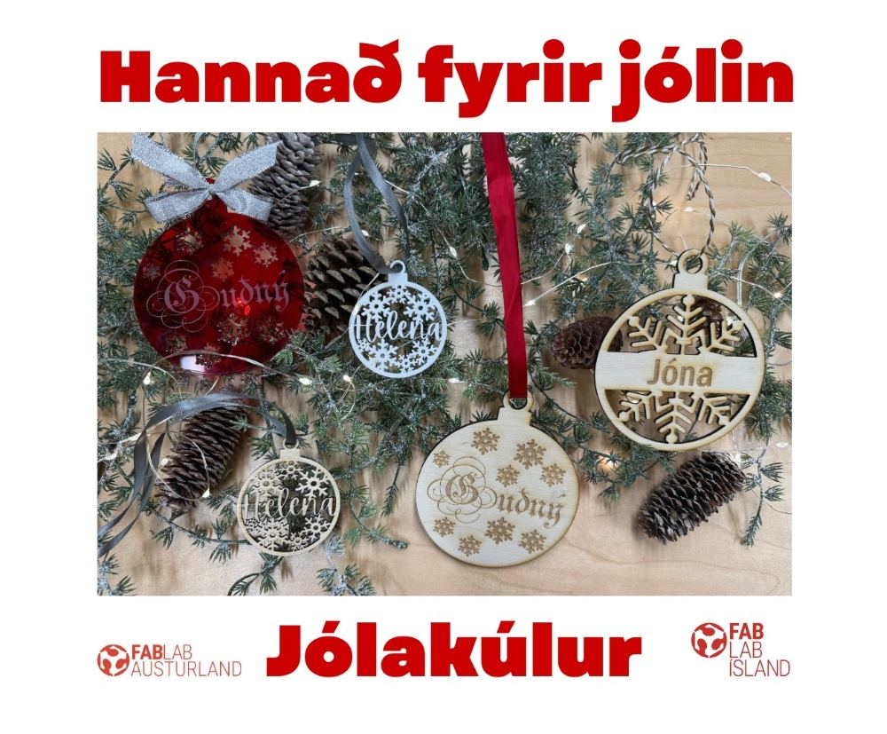

### Jólakúla 1 - Heill flötur þar sem texti og mynstur eru skorin út og/eða rasteruð

!!! note "Dæmi um hvernig hægt er að útfæra jólakúlu 1"
    
    

    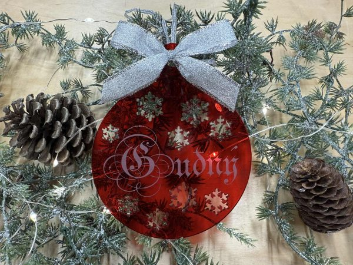

!!! note "Sniðmát notað sem grunnur að jólakúlu 1"
    
    * Með því að smella á hlekkinn hér fyrir neðan færð þú Inkscape skjal sem þú getur notað sem grunn að jólakúlu. 

    * Þegar þú smellir á hlekkinn birtist mynd af sniðmátinu fyrir jólakúluna. Hægrismelltu á myndina og veldu að vista hana sem .svg skrá.
    
    * Athugaðu að þessi kúla er 100mm í þvermál en þú getur stillt stærðina að þínum óskum. 
    
    * Opnaðu skrána. Þá sérðu jólakúlu með svörtum útlínum.

    [Jólakúla 1 .svg skrá](img_leidbeiningar/Jolakula_snidmat_heil.svg){ .md-button }

!!! note "Að setja texta á jólakúluna"
    
    * Smelltu á **táknið með bókstafnum A**. Þú finnur það á stikunni vinstra megin á skjánum. 
    
    * Smelltu svo á skjáinn og byrjaðu að skrifa. Efst á skjánum getur þú valið leturgerð og stærð letursins.

    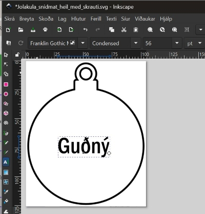

!!! note "Að vinna með letur og stærð"
    
    * Þú getur einnig smellt á **Texti og letur (Text and font)**. Þannig getur þú valið á mismunandi leturgerðir og séð hvernig það mun líta út. 
    
    * Smelltu svo á **virkja (Apply)** til að velja letrið sem þú ætlar að nota.

    

!!! note "Að finna myndir á netinu til að nota sem skraut"
    
    * Skrifaðu leitarorð og bættu orðinu **Silhouette** eða **Black and white** á eftir. 

    * Mikilvægt er að virða höfundarrétt annarra. Meðal annars er hægt að finna myndir sem höfundar gefa leyfi til að nota með því að leita að myndum með Creative commons leyfi. Það er gert á eftirfarandi hátt:
    
    * Smelltu á **Myndir (Images)**. 
    
    * Veldu **Verkfæri (Tools)** og **Notkunarréttur (Usage rights)**. 
    
    * Veldu svo **Creative Commons** leyfið.

    

    * Hægrismelltu á myndina sem þú vilt nota og veldu **Vista mynd sem (Save image as)**. 
    
    * Skráargerðirnar .jpg,.jpeg og .png henta vel í svona verkefni.

!!! note "Að flytja mynd inn í Inkscape"
    
    * Smelltu á **Skrá (File)** og **Flytja inn (Import)**. Smelltu svo á **Í lagi (OK)**. Þá birtist myndin á skjánum.

    

!!! note "Að búa til vektorteikningu eftir myndinni"
    
    * Nauðsynlegt er að láta Inkscape búa til vektorteikningu eftir myndinni, svo hægt sé að vinna með teikninguna á ýmsan hátt. 
    
    * Smelltu á **Ferill (Path)** og **Línuteikna bitamynd (Trace bitmap)**. 
    
    * Veldu myndina með því að smella á myndina (þá sjást örvar í kringum hana). Smelltu svo á **Virkja (Apply)**. 
    
    * Myndin hér fyrir neðan sýnir stillingarnar (0.450) sem voru notaðar hér en það er hægt að auka og minnka litmörk ef myndin kemur ekki nógu vel út. 
    
    * Vektorteikningin sem forritið bjó til liggur nú ofan á upphaflegu myndinni. Dragðu hana til hliðar.

    

!!! example "Að eyða réttu myndinni"
    
    * Smelltu á myndina og vektorteikninguna til skiptis. 
    
    * Þegar þú sérð að það stendur **Mynd (Image)** neðst á skjánum skaltu eyða þeirri mynd. 
    
    * Smelltu svo á vektorteikninguna og veldu einhvern lit úr litastikunni sem er neðst á skjánum. Það auðveldar þér að raða saman vektorteikningunni og jólakúlunni. 

    

!!! note "Að vinna með myndirnar í Inkscape"
    
    * Ef þú vilt fá fleiri myndir hægrismellir þú á myndina og velur **Afrita (Copy)**. 
    
    * Svo hægrismellir þú á skjáinn og velur **Líma (Paste)**. 

    

!!! note "Að vinna með myndirnar í Inkscape"
    
    * Ef þú vilt stækka og minnka formin getur þú gripið í örina á horninu og togað hana til og frá. Þannig stækka og minnka formin. 

    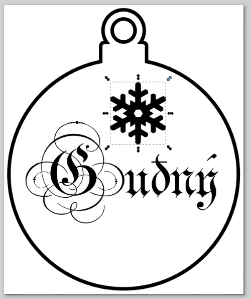

!!! info "Vinnusvæði stillt utan um hönnunina" 
    
    * Til að nýta efnið vel er gott að stilla vinnusvæðið utan um hönnunina.

    1. **Hægrismelltu á skjáinn** og veldu **Eiginleikar skjals (Document properties)**. 
    * Veldu myndina.
    2. Smelltu á **Aðlaga stærð að innihaldi (Resize to content)**.
    3. Smelltu **þrisvar á báða plúsana** (Í næsta skrefi færir þú hönnunina betur inn á vinnusvæðið. Þetta dregur úr hættunni á að skurðarlínur fari óvart út fyrir brún vinnusvæðisins).

    

!!! info "Að jafna og dreifa miðað við síðu"
    
    * Smelltu á **Hlutur (Object)** og veldu svo **Jafna og dreifa (Align and distribute)**. 
    
    * Veldu að jafna **miðað við síðuna** og **miðjaðu svo bæði á láréttum og lóðréttum ás (x- og y-ás)**. Þá er hönnunin á miðri síðunni.

    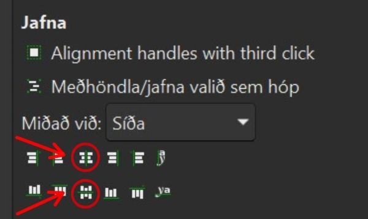   

!!! note "Að stilla skurðarlínur"
    
    * Næst velur þú þau svæði sem þú vilt láta skera út. 
    
    * Fyrst þarftu að smella á **Hlutur (Object)** og svo **Fylling og útlína (Fill and stroke)**. 
    
    * Þú smellir á þann flipa sem þú ætlar að vinna með. 
    
    * Byrjaðu á að smella á flipann merktan **Fylling (fill)** og slökktu á fyllingunni.

    

    * Næst velur þú flipann sem merktur er **Litur útlínu (Stroke style)** og kveikir á lit útlínunnar. 
    
    * Athugaðu að það á að nota **RGB** og undir því á rauði liturinn að fara upp í það mesta, sem er **255**. 
    
    * Passaðu einnig að neðsta stikan (Alpha channel sem er merkt með A) sé stillt á 100. Þessi stika er notuð til að stilla hvort litur sé gegnsær eða ekki.

    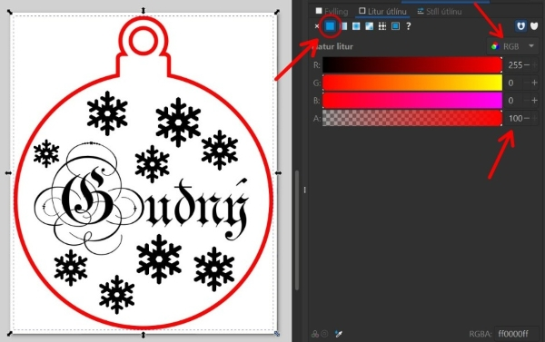

    * Að lokum smellir þú á flipann sem merktur er **Stíll útlínu (Stroke style)** og stillir línuþykktina á **0,02mm**. 
    
    * Það getur verið misjafnt eftir tölvum hvort það á að skrifa töluna með punkti eða kommu. Ef þú skrifar 0,02 en talan breytist í 0.000 skaltu skipta á milli punkts og kommu.

    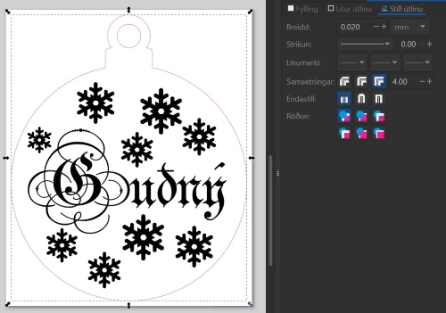

!!! note "Að stilla fyrir brennimerkingu (rasteringu)"
    
    * Næst velur þú þau svæði sem á að brennimerkja. 
    
    * Undir flipanum sem merktur er **Fylling (Fill)** á að kveikja á fyllingunni. 

    _600x318.jpg>)

    * Undir flipanum sem merktur er **Litur útlínu (Stroke style)** á að slökkva á línunni með því að smella á x-ið.

    

!!! note "Að vista skjal"
    
    * Smelltu á **Skrá (File)** og **Vista sem (Save as)**. 
    
    * **Veldu *pdf** undir **Save as type**. 
    
    * Það er einnig gott að vista skrána sem .svg (Inkscape skrá) því þá er auðvelt að opna þá skrá og gera breytingar ef eitthvað þarf að laga. 
    
    * Að lokum notar þú PDF skjalið til að laserskera og rastera í lasernum.

    

### Jólakúla 2

!!! example "Jólakúla með borða í miðjunni"
    
    Þetta er dæmi um hvernig hægt væri að útfæra jólakúlu 2.

    

!!! example "Sniðmát notað sem grunnur að jólakúlu 2"
    
    * Með því að smella á hlekkinn hér fyrir neðan færð þú Inkscape skjal sem þú getur notað sem grunn að jólakúlu. 
    
    * Þegar þú smellir á hlekkinn birtist mynd af kúlunni. Hægrismelltu á hana og veldu að vista sem .svg. 
    
    * Opnaðu svo skrána.

    [Jólakúla 2 - sniðmát](files_leidbeiningar/JolakulaMidja_snidmat.svg){ .md-button }

!!! example "Að stilla stærðina"
    
    * Þegar þú smellir á jólakúluna sérðu efst á stikunni að hún er 100mm breið og rúmlega 121mm á hæð en þú getur stillt stærðina að þínum óskum. 
    
    * Með því að smella á litla lásinn sem er á milli talnanna haldast hlutföllin rétt ef þú breytir tölunum. 

    

!!! examplee "Að finna myndir á netinu til að nota sem skraut"
    
    * Skrifaðu leitarorð og bættu orðinu **Silhouette** eða **Black and white** á eftir. 
    
    * Mikilvægt er að virða höfundarrétt annarra. Meðal annars er hægt að finna myndir sem höfundar gefa leyfi til að nota með því að leita að myndum með Creative commons leyfi:
    
    * Smelltu á **Myndir (Images)**. Veldu **Verkfæri (Tools)** og **Notkunarréttur (Usage rights)**. Veldu svo **Creative Commons** leyfið.

    

    * Hægrismelltu á myndina sem þú vilt nota og veldu **Vista mynd sem (Save image as)**. Skráargerðirnar .jpg,.jpeg og .png henta vel í svona verkefni.

!!! example "Að flytja mynd inn í Inkscape"
    
    * Smelltu á **Skrá (File)** og **Flytja inn (Import)**. Smelltu svo á **Í lagi (OK)**. Þá birtist myndin á skjánum.

    

!!! example "Að búa til vektorteikningu eftir myndinni"
    
    * Nauðsynlegt er að láta Inkscape búa til vektorteikningu eftir myndinni, svo hægt sé að vinna með teikninguna á ýmsan hátt. 
    
    * Smelltu á **Ferill (Path)** og **Línuteikna bitamynd (Trace bitmap)**. 
    
    * Veldu myndina með því að smella á myndina (þá sjást örvar í kringum hana). 
    
    * Smelltu svo á **Virkja (Apply)**. 
    
    * Myndin hér fyrir neðan sýnir stillingarnar sem voru notaðar hér en það er hægt að auka eða minnka litmörk ef myndin kemur ekki nógu vel út. 
    
    * Vektorteikningin sem forritið bjó til liggur nú ofan á upphaflegu myndinni. Dragðu hana til hliðar.

    

!!! example "Að eyða réttu myndinni"
    
    * Smelltu á myndina og vektorteikninguna til skiptis. 
    
    * Þegar þú sérð að það stendur **Mynd (Image)** neðst á skjánum skaltu eyða þeirri mynd. 
    
    * Smelltu svo á vektorteikninguna og veldu einhvern lit úr litastikunni sem er neðst á skjánum. Það auðveldar þér að raða saman skrautinu og jólakúlunni. 

    

!!! example "Að vinna með myndirnar í Inkscape"
    
    * Ef þú vilt stækka og minnka formin getur þú gripið í örina á horninu og togað hana til og frá. Þannig stækka og minnka formin. 

    

!!! example "Að bræða form saman"
    
    * Til að snjókornið og jólakúlan verði ein heild og skeri ekki hvort annað í sundur þarf að bræða þau saman. 
    
    * Veldu bæði formin og smelltu á **Ferill (Path)** og **Bræða saman (Union)**.

    

!!! example "Að eyða ákveðnum atriðum"
    
    * Ef þú vilt eyða hlutum úr myndinni er hægt að gera það á ýmsa vegu. Á þessari mynd eru t.d. litlar örvar í hægra horninu niðri sem voru óþarfi. 
    
    * Til að eyða út litlu örvunum var smellt á **hnútaverkfærið (Node tool)** og smellt á svæðið. Þá sáust allir hnútarnir sem mynda formið. 
    
    * Með því að draga með músinni yfir svæðið og velja þannig tiltekna hnúta er hægt að eyða þeim með því að ýta á **Delete**.

    

!!! example "Að bæta við texta"
    
    * Veldu táknið með bókstafnum **A** sem er á stikunni vinstra megin. 
    
    * Smelltu svo á skjáinn og byrjaðu að skrifa. 
    
    * Veldu einhvern lit úr litastikunni neðst, svo auðvelt sé fyrir þig að sjá textann þegar þú stillir honum upp á jólakúlunni. 
    
    * Ef textinn sést alls ekki er líklegt að þú þurfir að velja **Hlutur (Object)** og **fylling og útlína (Fill and stroke)**. 
    
    * Þar undir smellir þú á flipann sem merktur er **Fylling (Fill)** og kveikir á fyllingunni (annar reitur frá vinstri). 
    
    * Efst sérðu hvaða leturgerð þú ert að nota og hver stærð textans er í pt.

    

!!! example "Að skipta um leturgerð"
    
    * Þú getur einnig smellt á **Texti og letur (Text and font)**. Þannig getur þú valið á mismunandi leturgerðir og séð hvernig það mun líta út. Smelltu svo á **virkja (Apply)** til að velja letrið sem þú ætlar að nota.

    

!!! info "Vinnusvæði stillt utan um hönnunina" 
    
    * Til að nýta efnið vel er gott að stilla vinnusvæðið utan um hönnunina.

    1. **Hægrismelltu á skjáinn** og veldu **Eiginleikar skjals (Document properties)**. 
    * Veldu myndina.
    2. Smelltu á **Aðlaga stærð að innihaldi (Resize to content)**.
    3. Smelltu **þrisvar á báða plúsana** (Í næsta skrefi færir þú hönnunina betur inn á vinnusvæðið. Þetta dregur úr hættunni á að skurðarlínur fari óvart út fyrir brún vinnusvæðisins).

    

!!! info "Að jafna og dreifa miðað við síðu"
    
    * Smelltu á **Hlutur (Object)** og veldu svo **Jafna og dreifa (Align and distribute)**. 
    
    * Veldu að jafna **miðað við síðuna** og **miðjaðu svo bæði á láréttum og lóðréttum ás (x- og y-ás)**. Þá er hönnunin á miðri síðunni.
  
     
    
!!! example "Að stilla skurðarlínur"
    
    * Næst velur þú þau svæði sem þú vilt láta skera út. 
    
    * Fyrst þarftu að smella á **Hlutur (Object)** og svo **Fylling og útlína (Fill and stroke)**. Þú smellir á þann flipa sem þú ætlar að vinna með. 
    
    * Byrjaðu á að smella á flipann merktan **Fylling (fill)** og slökktu á fyllingunni.

    

    * Næst velur þú flipann sem merktur er **Litur útlínu (Stroke style)** og kveikir á lit útlínunnar. 
    
    * Athugaðu að það á að nota **RGB** og undir því á rauði liturinn að fara upp í það mesta, sem er **255**. 
    
    * Passaðu einnig að neðsta stikan (Alpha channel sem er merkt með A) sé stillt á 100. Þessi stika er notuð til að stilla hvort litur sé gegnsær eða ekki.

    

    * Að lokum smellir þú á flipann sem merktur er **Stíll útlínu (Stroke style)** og stillir línuþykktina á **0,02mm**. 
    
    * Það getur verið misjafnt eftir tölvum hvort það á að skrifa töluna með punkti eða kommu. Ef þú skrifar 0,02 en talan breytist í 0.000 skaltu skipta á milli punkts og kommu.

    

!!! example "Að stilla fyrir brennimerkingu (rasteringu)"
    
    * Næst velur þú þau svæði sem á að brennimerkja. 
    
    * Undir flipanum sem merktur er **Fylling (Fill)** á að kveikja á fyllingunni. 
    
    

    * Undir flipanum sem merktur er **Litur útlínu (Stroke style)** á að slökkva á línunni með því að smella á x-ið.

    

!!! example "Að vista skjal"
    
    * Smelltu á **Skrá (File)** og **Vista sem (Save as)**. 
    
    * **Veldu *pdf** undir **Save as type**. 
    
    * Það er einnig gott að vista skrána sem .svg (Inkscape skrá) því þá er auðvelt að opna þá skrá og gera breytingar ef eitthvað þarf að laga. 
    
    * Að lokum notar þú PDF skjalið til að laserskera og rastera í lasernum.

    

### Jólakúla 3 - Unnin að hluta til í Canva

!!! tip "Jólakúla 3 er unnin að hluta til í Canva"
    
    Myndin hér sýnir dæmi um hvernig hægt er að útfæra jólakúlu 3

    

!!! tip "PNG mynd notuð sem sniðmát í Canva"
    
    * Með því að smella á hlekkinn hér fyrir neðan færð þú .png mynd sem þú getur notað sem grunn að jólakúlu. 
    
    * Eftir að þú smellir á hlekkinn færðu .png mynd upp á skjáinn. Hægrismelltu á myndina og vistaðu hana. 
    
    * Fyrstu skrefin eru svo unnin á vefsíðu Canva.com.

    [Sniðmát fyrir jólakúlu í Canva](img_leidbeiningar/JólakulaCanva_sniðmat.png){ .md-button }

{ .md-button }

!!! tip "Mynd hlaðið inn í Canva"
    
    * Búðu til nýtt skjal (New template) í Canva. 
    
    * Smelltu á **Upload** og sæktu myndina af jólakúlunni. 
    
    * Smelltu á myndina til að hún birtist á vinnusvæðinu.

    

!!! tip "Unnið með texta í Canva"
    
    * Smelltu á textatáknið á vinstri stikunni. 
    
    * Skrifaðu textann sem þú vilt hafa. 
    
    * Efst á skjánum getur þú breytt stærð textans og leturgerðinni.

    

!!! tip "Að nota myndir í Canva til að nota sem skraut"
    
    * Smelltu á **Elements** á vinstri stikunni. 
    
    * Skrifaðu leitarorð og bættu orðinu **Silhouette** eða **Black and white** á eftir. 
    
    * Ef þú finnur skýra, óskyggða, svart/hvíta mynd sem hentar getur þú smellt á hana og hún birtist á vinnusvæðinu. 
    
    * Ef þú finnur ekki mynd sem þér hentar skaltu fylgja næsta skrefi og finna mynd á netinu.

    

!!! tip "Að finna myndir á netinu til að nota sem skraut"
    
    * Skrifaðu leitarorð og bættu orðinu **Silhouette** eða **Black and white** á eftir. 
    
    * Mikilvægt er að virða höfundarrétt annarra. Meðal annars er hægt að finna myndir sem höfundar gefa leyfi til að nota með því að leita að myndum með Creative commons leyfi:
    
    
    * Smelltu á **Myndir (Images)**. Veldu **Verkfæri (Tools)** og **Notkunarréttur (Usage rights)**. 
    
    * Veldu svo **Creative Commons** leyfið

    

    * Hægrismelltu á myndina sem þú vilt nota og veldu **Vista mynd sem (Save image as)**. 
    
    * Skráargerðirnar .jpg,.jpeg og .png henta vel í svona verkefni.

!!! tip "Mynd með snjókorni (eða öðru skrauti) bætt við"
    
    * Hér er mynd af snjókorni sem var fundin á netinu, vistuð í tölvu og svo flutt inn í Canva með **Upload files**. 
    
    * Svo var smellt á myndina og hún birtist á vinnusvæðinu.

    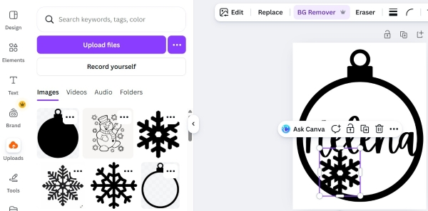

!!! tip "Mynd afrituð, límd og stækkuð eða minnkuð"
    
    * Þegar smellt er á mynd birtist tákn (**Duplicate**) og þegar smellt er á það verður til afrit af myndinni. Þannig er auðveldlega hægt að búa til mörg afrit. 
    
    * Svo er hægt að stækka og minnka myndirnar með því að grípa í hornin og draga þau til.

    

!!! tip "Jólakúlan flutt út úr Canva"
    
    * Þegar hönnunin er tilbúin er smellt á **Share** hnappinn efst til hægri og svo á **Download**.

    

    * Því næst er gerð skráarinnar valin. Hér er PNG valið en JPG virkar líka vel. 
    
    * Ef blaðsíðurnar í skjalinu eru fleiri en ein þarf að velja blaðsíðuna sem á að flytja út. 
    
    * Svo er smellt á **Download**.

    

!!! tip "Hönnunin flutt inn í Inkscape"
    
    * Inkscape er opnað og nýtt skjal búið til. 
    
    * Svo er smellt á **Skrá (File)** og **Flytja inn (Import)**. 
    
    * Myndin er valin og smellt á **Opna (Open)**. Þá opnast lítill gluggi þar sem smellt er á **OK**.

    

!!! tip "Vektorteikning búin til"
    
    * Nauðsynlegt er að láta Inkscape búa til vektorteikningu eftir myndinni, svo hægt sé að vinna með teikninguna á ýmsan hátt. 
    
    * Smelltu á **Ferill (Path)** og **Línuteikna bitamynd (Trace bitmap)**. 
    
    * Veldu myndina með því að smella á myndina (þá sjást örvar í kringum hana). 
    
    * Smelltu svo á **Virkja (Apply)**. 
    
    * Myndin hér fyrir neðan sýnir stillingarnar sem voru notaðar hér en það er hægt að auka eða minnka litmörk ef myndin kemur ekki nógu vel út. 
    
    * Vektorteikningin sem forritið bjó til liggur nú ofan á upphaflegu myndinni. Dragðu hana til hliðar.

    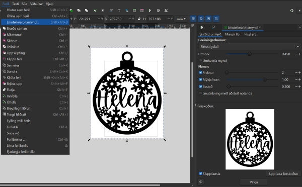

!!! example "Að eyða réttu myndinni"
    
    * Smelltu á myndina og vektorteikninguna til skiptis. 
    * Þegar þú sérð að það stendur **Mynd (Image)** neðst á skjánum skaltu eyða þeirri mynd. 

    

!!! tip "Stærð jólakúlu stillt í Inkscape"
    
    * Þegar þú smellir á jólakúluna sérðu efst á stikunni að hún er tæplega 58mm breið og 70mm á hæð en þú getur stillt stærðina að þínum óskum. 
    * Með því að smella á litla lásinn sem er á milli talnanna haldast hlutföllin rétt ef þú breytir tölunum. 

    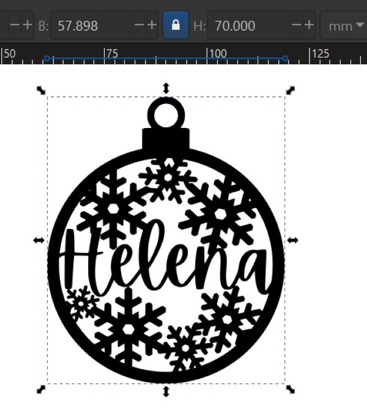

!!! tip "Vinnusvæði stillt utan um hönnunina" 
    
    * Til að nýta efnið vel er gott að stilla vinnusvæðið utan um hönnunina.

    1. **Hægrismelltu á skjáinn** og veldu **Eiginleikar skjals (Document properties)**. 
    * Veldu myndina.
    2. Smelltu á **Aðlaga stærð að innihaldi (Resize to content)**.
    3. Smelltu **þrisvar á báða plúsana** (Í næsta skrefi færir þú hönnunina betur inn á vinnusvæðið. Þetta dregur úr hættunni á að skurðarlínur fari óvart út fyrir brún vinnusvæðisins).

    

!!! tip "Að jafna og dreifa miðað við síðu"
    
    * Smelltu á **Hlutur (Object)** og veldu svo **Jafna og dreifa (Align and distribute)**. 
    
    * Veldu að jafna **miðað við síðuna** og **miðjaðu svo bæði á láréttum og lóðréttum ás (x- og y-ás)**. Þá er hönnunin á miðri síðunni.
  
      

!!! tip "Skurðarlínur stilltar í Inkscape"
    
    * Í þessu verkefni eru allar línur gerðar að skurðarlínum. 
    
    * Veldu alla jólakúluna. 
    
    * Smelltu á **Hlutur (Object)** og svo **Fylling og útlína (Fill and stroke)**. 
    
    * Þú smellir á þann flipa sem þú ætlar að vinna með. 
    
    * Byrjaðu á að smella á flipann merktan **Fylling (fill)** og slökktu á fyllingunni.

    

    * Næst velur þú flipann sem merktur er **Litur útlínu (Stroke style)** og kveikir á lit útlínunnar. 
    
    * Athugaðu að það á að nota **RGB** og undir því á rauði liturinn að fara upp í það mesta, sem er **255**. 
    
    * Passaðu einnig að neðsta stikan (**Alpha channel sem er merkt með **A**) sé stillt á **100**. Þessi stika er notuð til að stilla hvort litur sé gegnsær eða ekki.

    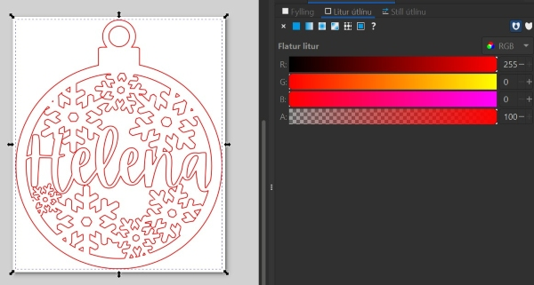

    * Að lokum smellir þú á flipann sem merktur er **Stíll útlínu (Stroke style)** og stillir línuþykktina á **0,02mm**. 
    
    * Það getur verið misjafnt eftir tölvum hvort það á að skrifa töluna með punkti eða kommu. Ef þú skrifar 0,02 en talan breytist í 0.000 skaltu skipta á milli punkts og kommu.

    

!!! tip "Að vista skjal"
    
    * Smelltu á **Skrá (File)** og **Vista sem (Save as)**. 
    
    * **Veldu *pdf** undir **Save as type**. 
    
    * Það er einnig gott að vista skrána sem .svg (Inkscape skrá) því þá er auðvelt að opna þá skrá og gera breytingar ef eitthvað þarf að laga. 
    
    * Að lokum notar þú PDF skjalið til að laserskera og rastera í lasernum.

    

### Jólakúla 4 - Unnin frá grunni!

!!! info "Hér er ekkert sniðmát notað heldur býrð þú kúluna til frá grunni"
    
    Þessar leiðbeiningar miða við að jólakúlan sé 10mm í þvermál en þú getur valið stærð að vild. Þegar þessi grunnur er tilbúinn mun hann líta út eins og á myndinni hér fyrir neðan. Svo getur þú bætt og breytt við grunninn eins og þér dettur í hug.

    

!!! info "Hér er ekkert sniðmát notað heldur býrð þú kúluna til frá grunni"
    
    * Byrjaðu á að velja **hringverkfærið** á vinstri stikunni. 
    
    
    
    * Teiknaðu fyrst hring sem er **100mm** í þvermál. 
    
    * Teiknaðu svo annan hring sem er **90mm** í þvermál. 
    
    * Veldu svo sinnhvorn litinn á hringina. 
   
    

!!! info "Sjást hringir ekki eins og hér er sýnt?"
    
    * Ef hringirnir birtast ekki fylltir með lit, líkt og á myndinni hér fyrir ofan, skaltu velja **Hlutur (Object)** og svo **Fylling og útlína (Fill and stroke)**. 
    
    * Þar skaltu smella á flipann merktan **Fylling (Fill)** og **kveikja á fyllingunni** (annar gluggi frá vinstri).

    

!!! info "Hringar jafnaðir"
    
    * Smelltu á **Hlutur (Object)** og svo **Jafna og dreifa (Align and distribute)**. 

    

    * Veldu báða hringina og **jafnaðu bæði lóðréttum og láréttum ás (y- og x-ás)**.

    

!!! info "Innri hringur gerður að gati"
    
    * Veldu báða hringana. 
    
    * Smelltu á **Ferill (Path)** og svo **Mismunur (Difference)**. Þá verður minni hringurinn að gati.

    

!!! info "Rétthyrningsverkfærið"
    
    * Veldu **rétthyrningsverkfærið** á stikunni vinstra megin og teiknaðu ferhyrning.

    

    * Stilltu breidd rétthyrningsins sem **20mm** og hæð hans sem **10mm**.

    

    * Á efstu stikunni er hægt að stilla hvort hornin á rétthyrningnum eru hvöss eða mjúk. Séu **Rx og Ry** stillt á 0 eru hornin hvöss en hér er valið að stilla á **3**.

    

!!! info "Að miðja ferhyrninginn og hringinn"
    
    * Smelltu á **Hlutur (Object)** og svo **Jafna og dreifa (Align and distribute)**. 
    
    * Veldu bæði hringinn og ferhyrninginn.  
    * Jafnaðu formin á **y- ás (lóðréttum ás)**.

    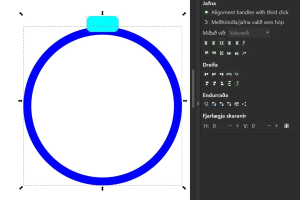

!!! info "Hringur og ferhyrningur brædd saman"
    
    * Veldu bæði formin. 
    * Smelltu á **Ferill (Path)** og svo **Bræða saman (Union)**.

!!! info "Tveir hringir fyrir festingu"
    
    * Teiknaðu tvo hringi. 
    
    * Hafðu þann stærri **18mm** í þvermál og þann minni **10mm** í þvermál.

    

!!! info "Litlu hringarnir sameinaðir með gati"
    
    * Veldu báða hringana. 
    **Jafnaðu bæði lóðréttum og láréttum ás (y- og x-ás)**.

    
    
    * Smelltu svo á **Ferill (Path)** og svo **Mismunur (Difference)**. Þá verður minni hringurinn að gati.

    

!!! info "Hér er ekkert sniðmát notað heldur býrð þú kúluna til frá grunni"
    
    * Stilltu hringnum upp á ferhyrningnum og **miðjaðu á lóðréttum ás (y-ás)**.

    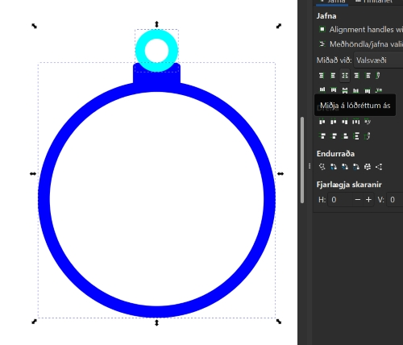

!!! info "Formin brædd saman"
    
    * Veldu bæði formin. 
    
    * Smelltu á **Ferill (Path)** og svo **Bræða saman (Union)**. Þá er grunnurinn að jólakúlunni tilbúinn.

    

!!! info "Bættu við skrauti að vild"
    
    * Nú getur þú bætt skrauti við jólakúluna. 
    * Þegar það er búið fylgir þú næstu skrefum.

!!! info "Vinnusvæði stillt utan um hönnunina" 
    
    * Til að nýta efnið vel er gott að stilla vinnusvæðið utan um hönnunina.

    1. **Hægrismelltu á skjáinn** og veldu **Eiginleikar skjals (Document properties)**. 
    * Veldu myndina.
    2. Smelltu á **Aðlaga stærð að innihaldi (Resize to content)**.
    3. Smelltu **þrisvar á báða plúsana** (Í næsta skrefi færir þú hönnunina betur inn á vinnusvæðið. Þetta dregur úr hættunni á að skurðarlínur fari óvart út fyrir brún vinnusvæðisins).

      

!!! info "Að jafna og dreifa miðað við síðu"
    
    * Smelltu á **Hlutur (Object)** og veldu svo **Jafna og dreifa (Align and distribute)**. 
    
    * Veldu að jafna **miðað við síðuna** og **miðjaðu svo bæði á láréttum og lóðréttum ás (x- og y-ás)**. Þá er hönnunin á miðri síðunni.
  
      

!!! info "Skurðarlínur stilltar í Inkscape"
    
    * Nú velur þú þau svæði sem þú vilt að séu skorin út. 
    * Myndirnar hér fyrir neðan sýna jólakúluna úr verkefninu **Jólakúla 3** en skurðarlínurnar þínar eru stilltar á sama hátt.
    
    *  Smelltu á **Hlutur (Object)** og svo **Fylling og útlína (Fill and stroke)**. 
    
    * Þú smellir á þann flipa sem þú ætlar að vinna með. 
    * Byrjaðu á að smella á flipann merktan **Fylling (fill)** og slökktu á fyllingunni.

    

    * Næst velur þú flipann sem merktur er **Litur útlínu (Stroke style)** og kveikir á lit útlínunnar. 
    * Athugaðu að það á að nota **RGB** og undir því á rauði liturinn að fara upp í það mesta, sem er **255**. 
    * Passaðu einnig að neðsta stikan (Alpha channel sem er merkt með A) sé stillt á 100. Þessi stika er notuð til að stilla hvort litur sé gegnsær eða ekki.

    

    * Að lokum smellir þú á flipann sem merktur er **Stíll útlínu (Stroke style)** og stillir línuþykktina á **0,02mm**. 
    * Það getur verið misjafnt eftir tölvum hvort það á að skrifa töluna með punkti eða kommu. Ef þú skrifar 0,02 en talan breytist í 0.000 skaltu skipta á milli punkts og kommu.

    

!!! info "Að vista skjal"
    
    * Smelltu á **Skrá (File)** og **Vista sem (Save as)**. 
    * **Veldu *pdf** undir **Save as type**. 
    * Það er einnig gott að vista skrána sem .svg (Inkscape skrá) því þá er auðvelt að opna þá skrá og gera breytingar ef eitthvað þarf að laga. 
    * Að lokum notar þú PDF skjalið til að laserskera og rastera í lasernum.

    
