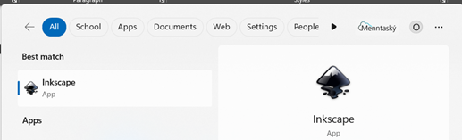
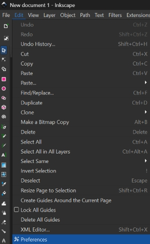
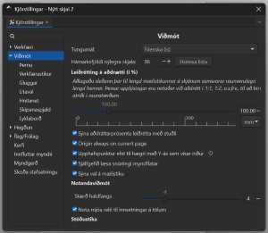

# Leiðbeiningar um notkun hugbúnaðar og tækjabúnaðar

## Inkscape 

### Að opna og nota Inkscape forritið

!!!Info "Inkscape forritið"

    Með Inkscape forritinu er hægt að hanna ótrúlega margt, til dæmis límmiða sem hægt er að skera út úr vínyl í vínylskera. Það er líka hannað eitthvað til að skera og rastera í laser. Neðar á síðunni, á hlekknum fyrir *Kennslubækur, kennslumyndbönd og leiðbeiningar* er kennsluefni fyrir Inkscape hjá efni fyrir vínylskera og laserskera.

!!! Info "Að opna Inkscape"

    Tvísmellið á Inkscape táknið til að opna forritið. Ef þið sjáið ekki táknið getið þið skrifað Inkscape í leitargluggann neðst á skjánum og tvísmellt svo á táknið þegar það birtist.

    

!!! Info "Tvísmellið á táknið"

    Tvísmellið svo á táknið þegar þið sjáið það. Stundum er forritið lengi að opnast svo það er gott að bíða smástund til að sjá hvort það opnist. Annars tvísmellið þið aftur.

    

### Að skipta um tungumál í Inkscape

!!! Tip "Íslenska eða annað tungumál"

    Það er hægt að skipta um tungumál í Inkscape en það þarf að loka forritinu þegar búið er að skipta um tungumál og opna forritið svo aftur. Smellið á Breyta og svo Kjörstillingar. Hér fyrir neðan sjáið þið hvernig þetta lítur út þegar forritið er stillt á íslensku og þegar það er stillt á ensku.

               

!!! Tip "Íslenska eða annað tungumál - framhald"

    Því næst smellið þið á Viðmót (á ensku er það Interface) og þá sjáið þið hvar þið getið valið tungumál. Munið svo að loka forritinu og opna það aftur.

                

## Kennslubækur, kennslumyndbönd og leiðbeiningar

!!! Example "Skapandi námssamfélag og Fab Lab Reykjavík"
    
    Á vefsíðunni [Fabmennt.com](https://www.fabmennt.com/_files/ugd/0ebced_5a3d811e82fa4290be7d3fb604a5251b.pdf) er hægt að finna kennslubækur með leiðbeiningum um notkun vínylskera, laserskera (geislaskera) og um þrívíddarhönnun. *Bækurnar gerði Hafey Viktoría Hallgrímsdóttir hjá Fab Lab Reykjavík.*

    

!!! Example "Leiðbeiningar hjá Fabmennt"
    
    Á vefsíðunni [Fabmennt.com](https://www.fabmennt.com/_files/ugd/0ebced_5a3d811e82fa4290be7d3fb604a5251b.pdf) er einnig hægt að finna kennslumyndbönd og leiðbeiningar. 

    

### Vínylskeri - límmiðar, fatalímmiðar, endurskinsmerki og gluggafilmur

!!! Example "Leiðbeiningar um gerð límmiða, fatalímmiða og gluggafilmu"
    
    Smellið [hér](https://www.fabmennt.com/leidbeiningarvinyl) til að skoða leiðbeiningar um hvernig hægt er að búa til límmiða, fatalímmiða, endurskinsmerki og gluggafilmu í vínylskera. *Höfundar: Hafey Viktoría Hallgrímsdóttir og Þóra Óskarsdóttir.*

!!! Example "Myndbönd um gerð límmiða, fatalímmiða og gluggafilmu"
    
    Smellið [hér](https://www.fabmennt.com/myndbondvinyl) til að skoða kennslumyndbönd um hvernig hægt er að búa til límmiða, fatalímmiða, endurskinsmerki og gluggafilmu í vínylskera. *Höfundar: Andri Sæmundsson og Hafey Viktoría Hallgrímsdóttir.*

### Laserskurðarvél (geislaskeri) - rasterað eða skorið úr plexígleri, timbri og fleiru

!!! Example "Leiðbeiningar um gerð glasamottu, Halloween skreytinga, lyklakippu, jólaskrauts og fleira"
    
    Smellið [hér](https://www.fabmennt.com/leidbeiningargeisla) til að skoða leiðbeiningar um hvernig hægt er að búa til glasamottu, Halloween skreytinga, lyklakippu, jólaskrauts og fleira. *Höfundar: Hafey Viktoría Hallgrímsdóttir og Þóra Óskarsdóttir.*

!!! Example "Myndbönd um gerð glasamottu, lyklakippu, jólaskrauts og fleira"
    
    Smellið [hér](https://www.fabmennt.com/myndbondgeisla) til að skoða kennslumyndbönd um hvernig hægt er að búa til glasamottu, lyklakippu, jólaskraut, kassa og fleira. *Höfundur: Andri Sæmundsson.*

### Þrívíddarhönnun og þrívíddarprentun

!!! Example "Leiðbeiningar um þrívíddarprentun og hönnun þrívíðra hluta"
    
    Smellið [hér](https://www.fabmennt.com/leidbeiningar3d) til að skoða leiðbeiningar um hvernig hægt er að hanna þrívíða hluti og prenta þá út. *Höfundur: Hafey Viktoría Hallgrímsdóttir.*

!!! Example "Kennslumyndbönd um gerð þrívíðra hluta"
    
    Smellið [hér](https://www.fabmennt.com/myndbond3d) til að skoða leiðbeiningar um hvernig hægt er að hanna þrívíða hluti. *Höfundur: Andri Sæmundsson.*

!!! Example "Kennslumyndbönd um þrívíddarhönnun í Tinkercad"
    
    Á vefsíðu Fab Lab Ísland er að finna kennslumyndbönd um þrívíddarhönnun í Tinkercad. Smellið [hér](https://fablab.is/fablab-kennsluefni/hugbunadur/tinkercad/) til að skoða leiðbeiningar um hvernig hægt er að hanna þrívíða hluti í Tinkercad forritinu. *Höfundur: Vilhjálmur Magnússon.*

!!! Example "Kennslumyndbönd um þrívíddarhönnun í SketchUp"
    
    Á vefsíðu Fab Lab Ísland er að finna kennslumyndbönd um þrívíddarhönnun í SketchUp. Smellið [hér](https://fablab.is/fablab-kennsluefni/hugbunadur/sketchup/) til að skoða leiðbeiningar um hvernig hægt er að hanna þrívíða hluti í SketchUp forritinu. *Höfundur: Vilhjálmur Magnússon.*

!!! Example "Kennslumyndbönd um þrívíddarhönnun í Fusion 360"
    
    Á vefsíðu Fab Lab Ísland er að finna kennslumyndbönd um þrívíddarhönnun í Fusion 360. Smellið [hér](https://fablab.is/fablab-kennsluefni/hugbunadur/sketchup/) til að skoða leiðbeiningar um hvernig hægt er að hanna þrívíða hluti í Fusion 360 forritinu. *Höfundur: Vilhjálmur Magnússon.*

!!! Example "Kennslumyndband um notkun Slicer for Fusion 360"
    
    Á vefsíðu Fab Lab Ísland er að finna kennslumyndbönd um hvernig hægt sé að umbreyta þrívíddarskrám þannig að módel sé sneitt niður. Smellið [hér](https://fablab.is/fablab-kennsluefni/hugbunadur/sketchup/) til að skoða leiðbeiningar um hvernig hægt er að umbreyta þrívíðum hlut í sneiðar í Slicer for Fusion 360 forritinu. *Höfundur: Vilhjálmur Magnússon.*

